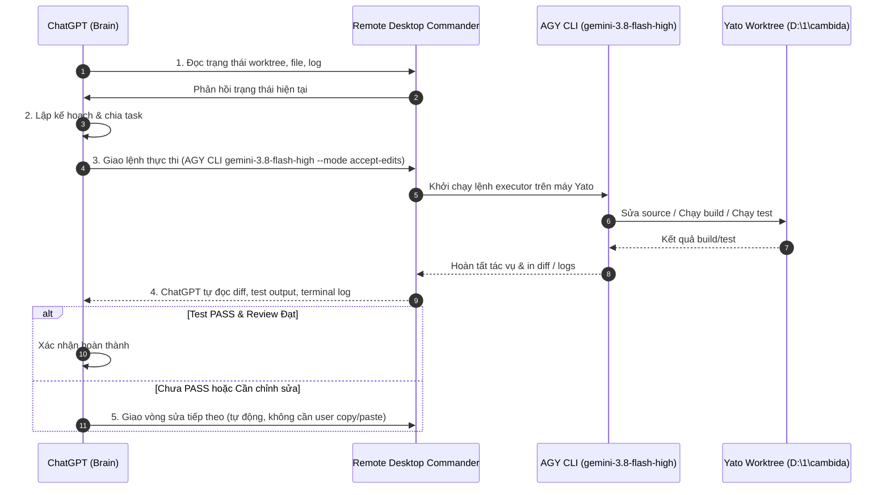

# YATO REMOTE WORKFLOW — cambida

Tài liệu mô tả quy trình làm việc chuẩn giữa **ChatGPT**, **Remote Desktop Commander**, và các executor (**AGY CLI**, **Codex CLI**) trên máy Yato (`D:\1\cambida`).

---

## 1. Mô hình Phân quyền & Vai trò

| Thành phần | Vai trò chính | Chi tiết kỹ thuật |
| :--- | :--- | :--- |
| **ChatGPT** | Bộ não / Điều phối / Review | Lập kế hoạch, chia nhỏ task, duyệt diff, kiểm tra test output. |
| **Remote Desktop Commander** | Control Plane trực tiếp | Kênh kết nối và tương tác lệnh trực tiếp tới máy Yato. |
| **AGY CLI** | Primary Executor | Thực hiện chỉnh sửa code, chạy build/test. Bắt buộc dùng model `gemini-3.8-flash-high`, `--mode accept-edits` (khi sửa code) hoặc `--mode plan` (khi khảo sát). |
| **Codex CLI** | Secondary / Fallback Executor | Dự phòng hoặc đối chiếu khi AGY gặp sự cố/nghẽn. |
| **Google Drive** | Kênh phụ trợ dữ liệu nặng | Chỉ dùng để tải lên/xuống file lớn, video, binary hoặc artifact khi cần đưa lên cloud cho ChatGPT đọc. |
| **Local Worktree (Yato)** | Source of Truth duy nhất | Git worktree tại `D:\1\cambida` là nơi chứa mã nguồn hiện hành. |

---

## 2. Quy trình Làm việc Chuẩn (Standard Workflow)

### Chi tiết các bước:
1. **Khảo sát trạng thái trực tiếp**:
   - ChatGPT sử dụng Remote Desktop Commander để truy cập và kiểm tra trực tiếp trạng thái mã nguồn, cấu trúc thư mục, log lỗi trên máy Yato.
2. **Lập kế hoạch & Chia task**:
   - ChatGPT xây dựng kế hoạch thực hiện, phân chia các task rõ ràng theo phạm vi và mục tiêu kiểm chứng.
3. **Giao task cho Executor**:
   - Các task chỉnh sửa code dài, xử lý logic hoặc chạy test được giao trực tiếp cho **AGY CLI** với model `gemini-3.8-flash-high`, mode sửa code là `--mode accept-edits`, mode khảo sát là `--mode plan`.
   - Trường hợp cần đối chiếu hoặc khi AGY không khả dụng, sử dụng **Codex CLI** làm phương án thay thế (gợi ý lệnh non-interactive đáng tin cậy qua stdin: `$prompt | codex exec -C 'D:\1\cambida' --sandbox workspace-write -`).
4. **Thực thi và Tự động Kiểm tra**:
   - Executor tiến hành chỉnh sửa mã nguồn, thực thi build/test trên môi trường cục bộ Yato.
   - ChatGPT tự đọc diff thay đổi, log kiểm thử và output terminal qua Remote Desktop Commander để đánh giá.
   - **Quy tắc kiểm chứng**: Build, lint hoặc unit test không tự động là bằng chứng E2E hay thành công trên thiết bị thật.
5. **Vòng lặp Phản hồi Tự động (Auto-Loop)**:
   - Nếu kết quả chưa PASS hoặc phát hiện sai sót, ChatGPT tự động phát lệnh điều chỉnh cho vòng sửa tiếp theo. Người dùng không cần phải copy/paste prompt thủ công giữa các bên.

---

## 3. Chính sách Google Drive & Xử lý Khi Yato Offline

- **Vai trò giới hạn của Google Drive**:
  - Google Drive chỉ phục vụ lưu trữ file lớn/binary/artifact cần tải lên cloud để ChatGPT xem xét.
  - Google Drive **hoàn toàn không** được dùng làm source-of-truth, không dùng làm queue điều phối, không dùng làm sync barrier hay ACK.
- **Trường hợp máy Yato offline**:
  - Khi máy Yato ngắt kết nối, chỉ có thể đọc các dữ liệu/artifact đã được tải lên Google Drive trước đó.
  - **Quy tắc bất biến**: Tuyệt đối không được suy luận rằng dữ liệu trên Drive phản ánh mã nguồn mới nhất của dự án. Mọi sửa đổi chỉ có giá trị khi được thực hiện trên local worktree của máy Yato.
- **Lưu trữ lịch sử (Legacy Archive)**:
  - Toàn bộ dữ liệu `.ai_flow/` và protocol Drive/Watchdog v2.2 cũ được lưu trữ độc lập tại `D:\Yato\legacy\cambida-drive-watchdog-20260909` (ngoài active project để Google Drive không tiếp tục đồng bộ các control-plane artifact cũ).
